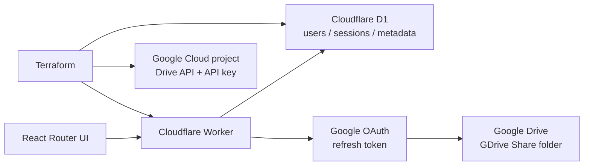

# GShare


파일 업로드, 폴더 공유, 패스키 로그인을 제공하는 파일 작업공간입니다.
Google Drive를 저장소로 사용하며, 초대받은 사용자만 파일을 볼 수 있습니다.

> 테스트용 MVP입니다. 단일 Google Drive 소유자와 하나의 공유 공간만 지원합니다.

## 무엇을 해결하나요?

- 관리자: Google Drive를 한 번 연결하고 사람을 초대합니다.
- 멤버: 초대 링크에서 비밀번호 계정을 만들고 필요하면 내 정보에서 패스키를 등록한 뒤 파일을 관리합니다.
- 서비스: Google Drive 소유자의 OAuth 권한으로 전용 폴더를 중계합니다.

```text
초대 링크 → ID·비밀번호 생성 → 비밀번호 로그인 → 필요 시 내 정보에서 패스키 등록 → 파일을 놓기
```

## 주요 기능

- 관리자 Google OAuth 로그인
- 사용자 ID·비밀번호 생성 + 내 정보에서 선택적 패스키 등록·제거
- 비밀번호 로그인 또는 패스키 로그인
- **멤버 관리**에서 계정 활성화·비활성화와 1시간짜리 일회성 비밀번호 변경 링크 발급 (분실 요청 처리도 지원)
- 관리자 초대 링크 발급·사용자 목록 확인
- Google Drive 전용 루트 폴더 자동 생성
- 개인 공간 최상위 폴더 보호, 폴더 생성·탐색·검색·이름 변경·휴지통·복구·영구 삭제
- 같은 위치의 중복 폴더 생성을 클라이언트·서버에서 차단
- 다중 파일 드래그앤드롭 업로드
- 내부 파일·폴더를 목록의 폴더나 경로의 상위 폴더로 드래그 이동
- 같은 이름의 파일은 건너뛰기·교체·덮어쓰기와 일괄 적용 선택
- 8MiB chunk, 진행률, 재시도, 취소 및 화면을 옮겨도 유지되는 업로드 현황
- 이미지·동영상·오디오·PDF·텍스트 미리보기와 인증된 다운로드
- 밝은 파일 작업공간 UI와 모바일 레이아웃

## 기술 구조



인증 코어는 Better Auth가 담당하고, 인증 테이블과 계정·세션·패스키를 포함한 모든 애플리케이션 데이터는 Drizzle ORM으로 D1에 저장합니다. Better Auth는 인증 테이블을, 서비스 코드는 사용자·초대·Drive ACL·파일·업로드·감사·관리자 비밀번호 변경 테이블을 같은 Drizzle schema로 사용합니다.

API 키는 프로젝트 식별과 API 제한에 사용하고, 개인 Drive 파일 접근은 OAuth refresh token으로만 수행합니다.
OAuth client 생성과 최초 동의는 Google Cloud Console에서 한 번 진행해야 합니다.

## 빠른 시작

### 요구사항

- Windows PowerShell 5.1+ (클린 Windows 도구 준비용)
- Cloudflare 계정
- Google Cloud 프로젝트를 만들 권한이 있는 계정
- 패스키를 사용하려면 최신 Chrome, Edge 또는 Safari (비밀번호 로그인만 사용할 경우 선택 사항)

### 1. 클린 Windows 도구 준비

아래 명령은 Bun, Terraform, Google Cloud CLI와 이 저장소의 Cloudflare Wrangler를 검사하고, 누락된 항목을 설치합니다. `winget`이 없는 환경에서는 각 도구의 공식 설치 경로를 사용합니다. Google·Cloudflare 계정 인증은 소유자 확인이 필요하므로 브라우저에서 직접 승인합니다.

```powershell
# 저장소를 clone한 직후 Bun 없이 실행할 수 있습니다.
powershell -ExecutionPolicy Bypass -File .\scripts\install-google-cloud-cli.ps1

# 변경 없이 설치 상태만 확인
powershell -ExecutionPolicy Bypass -File .\scripts\install-google-cloud-cli.ps1 -CheckOnly

# 설치된 Bun, Terraform, Google Cloud CLI, Wrangler까지 갱신
powershell -ExecutionPolicy Bypass -File .\scripts\install-google-cloud-cli.ps1 -Update

# Google ADC 로그인을 나중에 할 때
powershell -ExecutionPolicy Bypass -File .\scripts\install-google-cloud-cli.ps1 -SkipLogin

# Cloudflare 브라우저 로그인까지 진행할 때
powershell -ExecutionPolicy Bypass -File .\scripts\install-google-cloud-cli.ps1 -LoginCloudflare
```

`-Update`는 프로젝트의 `wrangler` 의존성과 lockfile도 갱신할 수 있으므로, 변경 내용을 검토한 뒤 커밋합니다.

### 2. 로컬 UI와 타입 검사

```powershell
bun install
bun run check
bun run test
bun run build
```

### 화면 기능 모킹 점검

로그인과 Google Drive 연결 없이 React Router 화면의 핵심 흐름을 재현하려면 개발 서버를
실행한 뒤 `?mock=1`을 붙입니다.

```powershell
bun run dev:mock
```

`http://127.0.0.1:4192/?mock=1`에서 업로드, 파일 선택·정렬, 미리보기, 새 폴더 생성,
이름 변경, 휴지통 이동·복구·영구 삭제, 하위 폴더 이동, breadcrumb을 통한 상위 폴더 이동을 확인할 수
있습니다. 폴더의 `공유 관리`를 눌러 현재 공유 대상과 초대 대기 상태를 확인하고, 모킹 멤버를
추가·제거하거나 권한을 저장한 뒤 `공유 폴더`에서
공유 결과가 다시 나타나는 흐름도 확인할 수 있습니다. 모킹 데이터는 브라우저 메모리에만
존재하며 실제 Drive나 D1에는 기록되지 않습니다.

파일 행의 드래그 핸들(⠿)을 잡아 `하위 폴더 A` 위에 놓으면 파일이 이동합니다. 폴더 안에서는
`저장 공간`으로 다시 끌어 루트 이동을 확인할 수 있으며, 체크박스·버튼·미리보기 영역에서
시작한 포인터 동작은 파일 이동으로 처리하지 않습니다.

권한별 화면은 `?mock=1&mockAccess=viewer` 또는 `?mock=1&mockAccess=editor`로 확인할 수
있습니다. 읽기 전용에서는 업로드·폴더 생성·이름 변경·공유·삭제가 숨겨지고, 편집자에서는
파일 변경은 가능하지만 폴더 공유 설정은 소유자 화면에서만 표시됩니다.

관리자 화면은 `http://127.0.0.1:4192/?mock=1&mockRole=admin`에서 멤버 초대와 비밀번호 변경
링크 생성, 각 사용자 공간 안 폴더의 `공유 관리`를 확인할 수 있습니다. 생성된 모킹 링크를 열면 초대·비밀번호 변경 화면도 `mock=1`
상태로 이어져 이름·아이디·비밀번호 입력과 제출 결과까지 확인할 수 있습니다. 실제 초대·로그인
화면은 API 계약을 사용하므로 `/invite/<token>`에서 계정 입력 검증, `/`에서 패스키 로그인과
비밀번호 변경 요청 UI를 별도로 점검할 수 있습니다. 실제 초대 링크를 생성하려면 인증된 관리자
API가 필요합니다.

이전 점검의 변경 상태를 버리고 처음부터 다시 확인하려면 `?mock=1&mockReset=1`로 접속합니다.

### Mock 브라우저 스모크 테스트

브라우저에서 실제 파일 선택 이벤트까지 자동으로 확인하려면 Chromium을 한 번 설치한 뒤
스모크 테스트를 실행합니다. `test:e2e`는 Vite·Cloudflare·D1 서버를 시작하지 않고,
`test:e2e:fixture`가 번들한 Home 화면을 Playwright route interception으로 제공합니다. 업로드
파일은 mock workspace 메모리에만 저장되며 Google Drive와 D1에는 기록되지 않습니다.

```powershell
bun x playwright install chromium
bun run test:e2e
```

브라우저 창을 직접 보면서 같은 테스트를 실행하려면 다음을 사용합니다.

```powershell
bun run test:e2e:headed
```

테스트는 파일 업로드·미리보기·중복 업로드 건너뛰기, 폴더 생성·이름 변경·중복 폴더 오류,
폴더 탐색, 휴지통 복구, viewer 읽기 전용, 관리자 초대 화면을 확인합니다. 실패 시
`test-results/`에 trace·screenshot·video가 남습니다.

`bun install`은 Lefthook의 `pre-commit`·`pre-push` 훅도 설치합니다. 커밋 전에는
포맷 검사, Biome·ESLint 린트, React Router 타입 생성·TypeScript 검사, Knip 데드코드 검사, Vitest를 순서대로
실행하며, push 전에는 같은 전체 게이트를 다시 실행합니다. 훅을 수동으로 확인하려면
다음 명령을 사용합니다.

```powershell
bunx lefthook run pre-commit
bunx lefthook run pre-push
```

### 3. 새 Cloudflare·Google 환경 프로비저닝

완전히 새 환경을 만들 때는 루트 Terraform 모듈을 사용합니다. 이 모듈은 Cloudflare D1·Worker와 Google Cloud 프로젝트·Drive API·API key를 생성합니다. `terraform.tfvars`에는 Cloudflare API token이 포함되므로 Git에 커밋하지 않습니다.

```powershell
Copy-Item terraform/terraform.tfvars.example terraform/terraform.tfvars
terraform -chdir=terraform init
terraform -chdir=terraform fmt -check
terraform -chdir=terraform validate
terraform -chdir=terraform plan
terraform -chdir=terraform apply
```

Terraform이 출력한 D1 ID를 `wrangler.jsonc`의 `database_id`에 넣습니다.
API 키는 다음 명령으로 확인할 수 있지만 Git이나 브라우저에 저장하지 않습니다.

```powershell
terraform -chdir=terraform output -raw google_drive_api_key
```

### 4. Cloudflare secret과 배포

```powershell
bunx wrangler secret put AUTH_SECRET
bunx wrangler secret put APP_ENCRYPTION_KEY
bunx wrangler secret put GOOGLE_CLIENT_ID
bunx wrangler secret put GOOGLE_CLIENT_SECRET
bunx wrangler secret put GOOGLE_API_KEY
bunx wrangler secret put GOOGLE_ADMIN_EMAILS
```

`APP_ENCRYPTION_KEY`는 32바이트 base64url 또는 64자리 hex 값이어야 합니다.
OAuth client의 redirect URI는 다음으로 설정합니다.

```text
https://<your-host>/api/auth/google/callback
```

관리자 Google 로그인, 최초 등록, Drive 재연결은 모두 같은 callback을 사용합니다.

### 5. D1 migration과 배포

```powershell
bunx wrangler d1 migrations apply gdrive-share --remote
bun run deploy
```

Drizzle 스키마가 바뀌면 먼저 `bun run db:generate`로 `drizzle/` migration을 생성·검토합니다. Cloudflare 배포용 migration은 `migrations/`에 forward-only SQL로 반영한 뒤 `bunx wrangler d1 migrations apply gdrive-share --local`에서 검증하고 원격에 적용합니다. 현재 기준선은 Wrangler `0001`~`0008`입니다.

배포 후 bootstrap 스크립트에 허용할 관리자 Google 이메일을 등록하고 관리자 Google OAuth를 완료합니다. 이후 관리자가 일반 사용자 초대 링크를 발급합니다.

### Google 관리자 bootstrap

Google 프로젝트/API 활성화/API key 생성, Google 관련 Worker secret 등록, 배포 및 초기 관리자 OAuth 화면 열기를 한 번에 실행할 수 있습니다.

> 이 스크립트는 `terraform/google`만 실행합니다. 새 Cloudflare 계정의 D1 생성, `wrangler.jsonc`의 새 D1 ID 반영, `AUTH_SECRET`과 `APP_ENCRYPTION_KEY` 생성은 처리하지 않습니다. 완전히 새 Cloudflare·Google 환경은 먼저 위의 루트 Terraform 절차를 완료하세요.

```powershell
# terraform.tfvars를 미리 만들지 않으면 bootstrap 스크립트가 값을 직접 묻습니다.
# 저장해서 재사용하려면 다음 두 줄을 사용합니다.
# Copy-Item terraform/google/terraform.tfvars.example terraform/google/terraform.tfvars
# terraform/google/terraform.tfvars에 bootstrap project, 새 project, billing 값을 입력
# 방법 A: Google Cloud CLI가 설치된 경우
gcloud auth application-default login
# 방법 B: 서비스 계정 JSON을 사용하는 경우
# bun run bootstrap:google-admin -- -GoogleCredentialsPath C:\secure\gdrive-terraform.json
bun run bootstrap:google-admin
# Linux/macOS/WSL/Git Bash
bun run bootstrap:google-admin:sh
```

Linux/macOS/WSL에서는 `bun run install:gcloud:sh`로 Google Cloud CLI 설치와 ADC 로그인까지 실행할 수 있습니다.

Google Web OAuth Client 자체는 Google Console에서 한 번 생성해야 합니다. bootstrap 스크립트가 OAuth 동의 화면을 먼저 열고, 동의 화면 설정과 테스트 사용자 등록을 완료한 뒤 client ID와 secret을 입력받아 Worker secret으로 등록합니다. 최종 관리자 동의는 관리자가 브라우저에서 직접 승인합니다.

## 보안 경계

- Google refresh token과 Drive upload session URL은 AES-GCM으로 암호화합니다.
- 세션은 HttpOnly cookie에만 저장합니다.
- 사용자 비밀번호는 Better Auth의 계정 테이블에 PBKDF2-SHA256으로 저장합니다.
- 사용자는 비밀번호 또는 등록한 패스키로 로그인할 수 있습니다.
- 원본 Drive session URL은 브라우저에 반환하지 않습니다.
- 앱이 생성한 전용 폴더 밖의 파일은 목록에 포함하지 않습니다.
- Google OAuth는 `email_verified`와 허용 관리자 목록을 함께 확인하며 Drive 재연결은 기존 Google subject와 일치해야 합니다.
- 초대 링크는 해시만 저장하며 24시간 후 또는 사용 즉시 무효화합니다.
- 비밀번호 변경 링크는 관리자가 활성 멤버를 선택해 즉시 발급하거나 분실 요청을 처리해 발급할 수 있으며, 해시만 저장하고 1시간 후 또는 사용 즉시 무효화합니다.
- 다운로드 응답은 `private, no-store`로 전달합니다.
- 공개 링크 토큰은 `no-referrer`로 외부에 전달하지 않으며 inline 텍스트는 `text/plain`으로 제공합니다.

## 테스트 범위

```powershell
bun run check
bun audit --audit-level=high
bun run security:public
bun run lint:biome
bun run lint
bun run lint:dead
bun run test
bun run format:check
terraform -chdir=terraform fmt -check
terraform -chdir=terraform validate
```

`bun run quality`는 Prettier 포맷 검사, Biome 린트, ESLint/React 린트, React Router 타입 생성·TypeScript 검사, Knip 데드코드 검사, Vitest를 순서대로 실행합니다. 각 단계가 실패하면 즉시 종료하며, ESLint는 warning도 허용하지 않습니다. Biome은 TypeScript/JavaScript/JSON 계열의 린트와 import·미사용 코드 검사를 담당합니다. Knip에 새 진입점이나 동적 로딩이 추가되면 `knip.json`의 `entry`를 함께 갱신합니다.

실제 배포 검증에서는 관리자 OAuth 로그인/Drive 연결, 외부 브라우저의 ID·비밀번호·패스키 등록, 비밀번호 변경 요청·링크 사용, 파일 업로드·재시도·다운로드·이름 변경·삭제·복구를 순서대로 확인해야 합니다.

## 제한사항

- 이메일 자동 발송 없음: 초대 링크와 비밀번호 변경 링크를 관리자 화면에서 복사해 전달합니다.
- R2 임시 보관과 Queue 비동기 처리는 포함하지 않습니다.
- ZIP 묶음 다운로드와 여러 Drive 소유자는 후속 과제입니다.
- Terraform state에는 민감한 출력이 포함될 수 있으므로 로컬 state를 Git에 커밋하지 않습니다.

자세한 설계와 운영 절차는 [`docs/design.md`](docs/design.md), [`docs/operations.md`](docs/operations.md)를 참고하세요.
